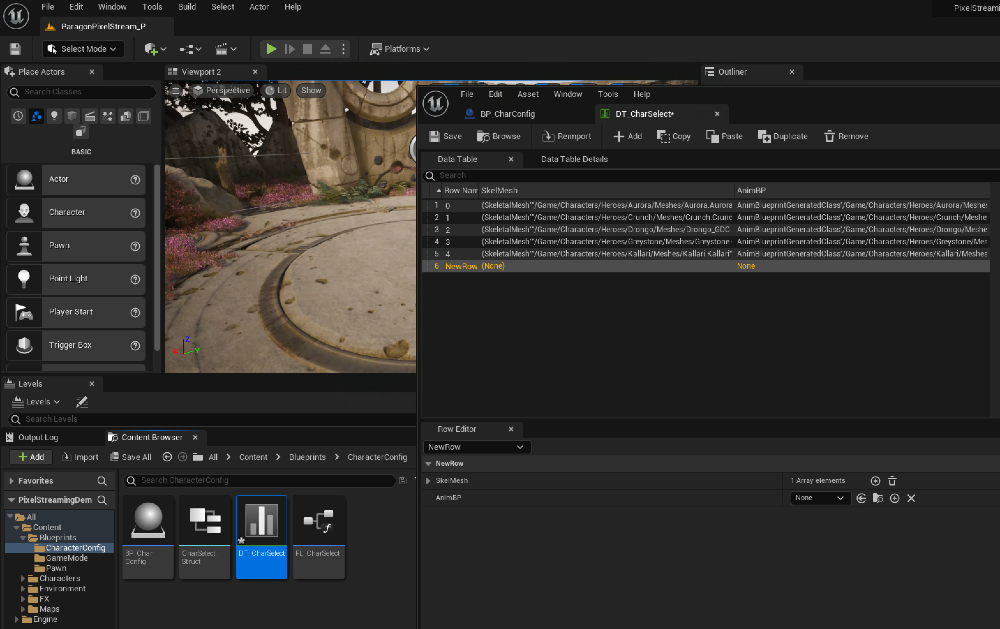
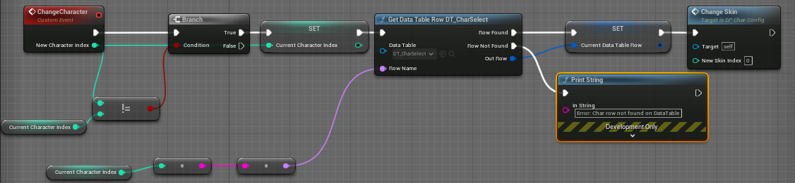
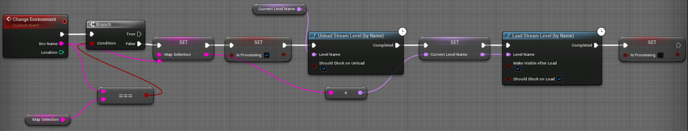
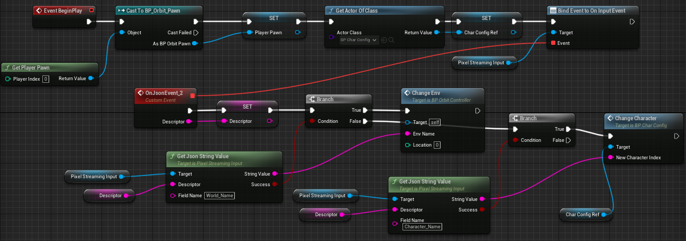

# Using the Unreal engine to create your own PUG dataset

#### Download the engine
The first step is to download the [Epic Games launcher](https://www.unrealengine.com/en-US/download).

After creating an Epic account and accepting the license agreement, you can download the Unreal Engine. For this work, we used Unreal Engine 5.0.3.
You can watch a video explaining the installation process of the Engine at the following [url](https://www.youtube.com/watch?v=rldy9yY0yDU&t=177s/).

#### Create a new Pixel streaming project
After installing the Unreal Engine, you will need to create a new project. We recommend to start your environment from the following [Pixel Streaming project](https://www.unrealengine.com/marketplace/en-US/product/pixel-streaming-demo). This project showcase how Pixel Streaming, which is a feature enabling WebRTC in Unreal, can be leveraged to create an interactive environment controllable through web-sockets. This is an ideal starting point to get familiar with Unreal and its possibilities.

### Understanding how it works
Unreal engine works mostly by scripting Blueprint, for more information about them, please visit the following [link](https://docs.unrealengine.com/5.0/en-US/introduction-to-blueprints-visual-scripting-in-unreal-engine/)

Once the pixel streaming demo is downloaded, you can open the DTCharSelect table file which is located in the Content/Blueprints/CharacterConfig folder as shown below. This table lists all the assets that can be loaded though the unreal environment. If you want to add a new character, just create a new entry in the table. To create PUG: Animals, we mostly added assets from the [Complete Animal Bundle](https://www.unrealengine.com/marketplace/en-US/product/complete-animals/) in the Epic Game Marketplace into this table.



In the project pixel streaming demo, you can use the content folder to visualize some of the pre existing blueprints. For example, in in the image below we visualize the Character Blueprint that manages the event *Change Character*. This event take as input an index (which corresponds to one of the table index in the image above), then it use this index to read the table with the function *Get Data Table*. If the index is found, then the function *Change Skin* will change which character is activated.



For PUG:ImageNet, instead of using the character table, we have used the plugin [glTFRuntime](https://github.com/rdeioris/glTFRuntime) to load assets downloaded from Sketchfab at runtime.

To change the scene in which the character is placed, see the blueprint below. The event *Change Environment* takes as input a world name (and can also take a location) and if the world name is different from the current world name (coined as *Map Selection*), it will unload the previous map from memory with the *Unload Stream Level* function while loading the new map with the *Load Stream Level* function. We also added an *is processing* variable to make sure that the environment is entirely loaded before processing anything else. Every level (or maps) is loaded into a main level; consequently, when changing the environment we only change the level visibility.



After creating the event *Change Environment* below that can change the configuration of a specific scene in such a way that it can take the world name as an input string, we need to be able to activate these event from the Pytorch Multiverse API by configuring them be called following a Pixel Streaming Event. Pixel Streaming is the feature inside Unreal Engine which enables communication using WebRTC between a running game/environment and a webserver. Here, we show how to call the *Change Character* event or the *Change Environment* event when the game is receiving a WebRTC packet. These packets are typically under a JSON Format. By using the *pixel streaming input* and calling the *Bind Event On Input Event*, we can activate the *OnJsonEvent* whenever a packet is received through WebRTC. This packet is saved under the name *descriptor* and read using the *Get Json String Value* function which return a string of a specific key is found in the JSON *descriptor*. For example, if the name *World Name* is found inside the JSON, then the first branch will return true and activate the *Change Environment* event that will take as input the corresponding value to the key *World_Name*. If the JSON packet does not contain the key *World_Name*, then the script will try to look if the key *Character Name* exists. If this is the case, it is the event *Change Character* that is called instead.



### Sampling the dataset through WebRTC
Once the PUG environment is ready to receive JSON packets through WebRTC, we use the [aiortc](https://github.com/aiortc/aiortc) python package to enable communication between our python scripts and the PUG environment. 

We have used json file to specify which factors to used when sampling the dataset. The config file used to create the PUG: Animal dataset can be found in the following [config file](./config/animal.json). 


This file is read and then all combination of values in this file is generated in such a way that we get a list of message from each combinations.  The first element of such list can be:
```
[{"World_Name": "Bridge"},
{"Character_Name": "Elephant"},
{"Character_Scale": "1.0"},
{"Camera_Yaw": "0"},
{"Character_Texture": "Default"},
] 
```

Then each element of this list is send to the python WebSocket client connected to the PUG environment using the send command. These elements are read as JSON data and activate the OnJsonEvent before. In consequence, when the dictionary:
```
{"World_Name": "Bridge_0"}
```
is sent to the PUG environment, it activates the event *Change Env* function presented in the blueprint.

The PUG environment will answer back by sending a JSON packet with the headers FreezeFrame (which is the integer 3) which mean that the packed can be decoded and save as an image.

### Sampling from a Linux cluster

In order to sample the datasets form a Linux cluster, first you should compile the interactive environment you created in the Unreal editor into [Linux binaries](https://docs.unrealengine.com/5.0/en-US/linux-development-requirements-for-unreal-engine/). Once compiled, send the compiled linux environment to your Linux cluster.

Then you should download the [Vulkan SDK](https://vulkan.lunarg.com/sdk/home#linux) (For this work, we have used the version 1.3.243.0) and enter the following:
```
cd ~/vulkansdk/1.3.243.0/
source ./setup-env.sh
```

Then, go into your Linux build (we called it Linux_Unreal_Game) and make the .sh file in this folder as executable. Then you can run the Linux binaries with:
```
CUDA_VISIBLE_DEVICES=0 ./AutoGen_Unreal.sh -AudioMixer -PixelStreamingIP=127.0.0.1 -PixelStreamingPort=8880 -graphicsadapter=0 -NoScreenMessages -RenderOffScreen&
```
This command will run the Unreal environment on GPU0 and will be streaming its content through the local port 8880.

Once the game is running, you should download the [Pixel Streaming Signaling Web server](https://github.com/EpicGames/PixelStreamingInfrastructure/tree/UE5.0) (that will manage the connections between your WebRTC client and Unreal). The following will run the signaling webserver on the port 8000.
```
cd SignallingWebServer/platform_scripts/bash
NO_SUDO=1 ./Start_SignallingServer.sh --HttpPort 8000 --StreamerPort 8880 --SFUPort 8890 > /dev/null 2>&1 &
```

Once you see that the signaling server is connected to the game, then you can run the main script that will sample the dataset using the running Unreal environment (Make sure to use the same port for the websocket as the one defined previously for the signaling webserver).
```
python run_sampling.py --outdir SAMPLING_DIRECTORY --offset 0 --ngpus 1 -s ws://127.0.0.1:8000
```